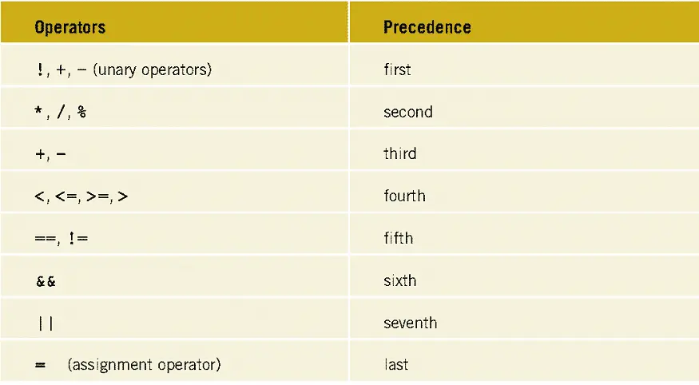

# 🚀 DSA in C++

## 📘 Topics
1. ⭐ Pattern  
2. 📌 (More coming soon…)

---

## 🎨 Pattern Outputs

  

     
    <b>Pattern 1</b>
  

  

     
    <b>Pattern 1</b>
  

  

     
    <b>Pattern 2</b>
  

  

     
    <b>Pattern 3</b>
  

---

## ✨ More patterns and DSA solutions will be added soon!
